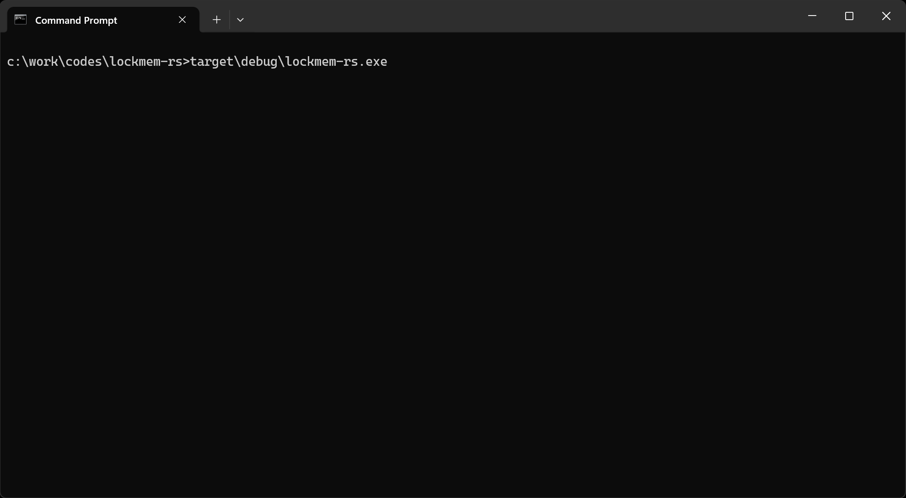

<div align='center'>
  <h1><code>lockmem-rs</code></h1>
  <p>
    <strong>Lock virtual memory regions of an arbitrary process into its working set.</strong>
  </p>
  <p>
    <a href="https://crates.io/crates/lockmem-rs"></a>
    
  </p>
  <p>
    
  </p>
</div>

## Overview

This utility allows you to lock every available memory regions of an arbitrary process into its working set. It uses [ntdll!NtLockVirtualMemory](https://ntdoc.m417z.com/ntlockvirtualmemory) (the system call used internally by [VirtualLock](https://learn.microsoft.com/en-us/windows/win32/api/memoryapi/nf-memoryapi-virtuallock)) to lock memory ranges and [GetProcessWorkingSetSizeEx](https://learn.microsoft.com/en-us/windows/win32/api/memoryapi/nf-memoryapi-getprocessworkingsetsizeex) / [SetProcessWorkingSetSizeEx](https://learn.microsoft.com/en-us/windows/win32/api/memoryapi/nf-memoryapi-setprocessworkingsetsizeex) to increase the size of the process working set.

The Windows kernel guarantees that those pages will stay resident in memory, not written to the pagefile and not incur a page fault on access.

## Installation

```text
cargo install lockmem-rs --locked
```

## Build

```text
git clone https://github.com/0vercl0k/lockmem-rs.git
cargo build --release
```

## Authors

* Axel '[0vercl0k](https://twitter.com/0vercl0k)' Souchet
